# Linux-Komutlari

# Sistem Yönetimi ve Bilgi Görüntüleme Komutları

## `df` Komutu
Bir dosya sisteminde yer alan toplam alana ve kullanılabilir alana ilişkin bilgileri görüntülemek için kullanılır.

```Bash
df
```

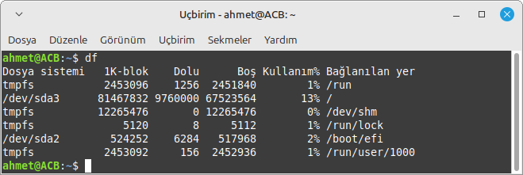

## `df -a` Komutu
Dosya sisteminin tüm ayrıntılarını gösterir.

 ```Bash
df -a
```


## `df -h` Komutu
Dosya sisteminin kullanım bilgilerini insan tarafından okunabilir formatta gösterir.
 ```Bash
df -h
```


## `df -i` Komutu
Dosya sistemi inode kullanım bilgilerini gösterir.
 ```Bash
df -i
```


## `top` Komutu
Çalışan işlemlerin ve çekirdek tarafından yönetilen görevlerin dinamik, gerçek zamanlı görünümünü gösterir.

```Bash
top
```

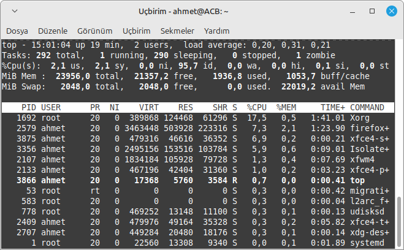

## `top -d 5` Komutu
omutunu her 5 saniyede bir günceller.
```Bash
top -d 5
```


## `top -n 10` Komutu
komutunun çıktısını 10 kez tekrarlar.
```Bash
top -n 10
```


## `top -p 1234` Komutu
Belirtilen işlem ID'sine (PID) sahip işlemi top komutuyla gösterir.
```Bash
top -p 1234
```

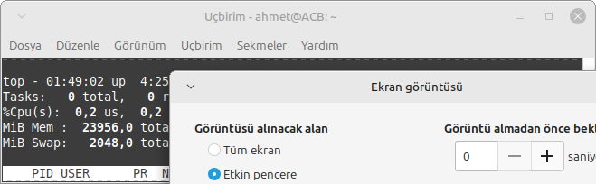

## `top -u username` Komutu
Belirli bir kullanıcının işlemlerini gösterir.
```Bash
top -u username
```

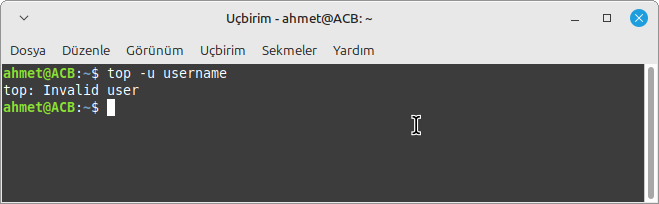

## `uptime` Komutu
 Sistemin ne kadar süre aktif kaldığını gösterir.

 ```Bash
uptime
```

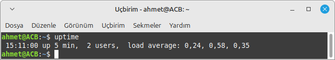

## `uname` Komutu
 Sistem hakkında bilgi verir. Geçerli makine ve üzerinde çalışdığı işletim sistemi hakkında isim, sürüm ve diğer ayrıntıları yazdırır.

```Bash
uname
```

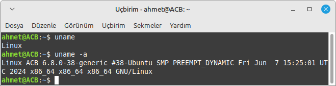

## `neofetch` Komutu
Sisteminizin bilgilerini işletim sistemi logonuzun veya seçtiğiniz herhangi bir ASCII dosyasının hemen yanında görüntüleyen bir komut satırı aracıdır.

```Bash
neofetch
```

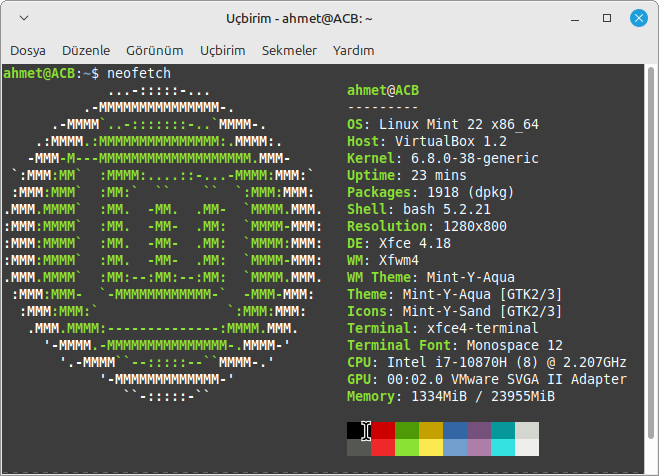

## `lscpu` Komutu
 Sistemdeki CPU'lar hakkında ayrıntılı bir bilgi listesi sağlar.

```Bash
lscpu
```


## `ifconfig` Komutu
Ağ arabirimi STRUCTURE yapısının dinamik olarak yaratılmasına ya da çekirdek belleğinden silinmesine olanak tanıyan ağ arabirimi yapılandırma aracıdır.

```Bash
ifconfig
```

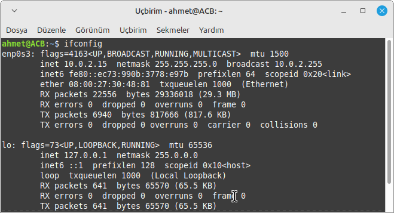

## `free` Komutu
Sisteminizdeki RAM belleğini kontrol etmenizi veya Linux işletim sisteminin bellek istatistiklerini kontrol etmenizi sağlar.

```Bash
free
```


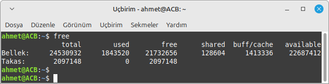

## `lshw` Komutu
Sistemin sahip olduğu donanımlarla ilgili ayrıntılı bilgi veren konsol programıdır.

```Bash
lshw
```

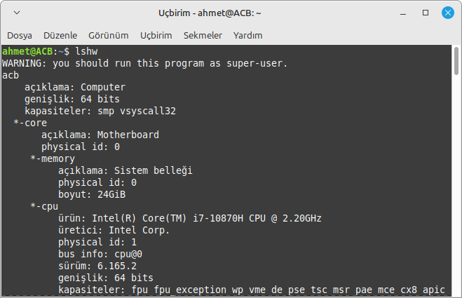

## `history` Komutu
Komut geçmişi listesiyle çalışır.

```Bash
history
```

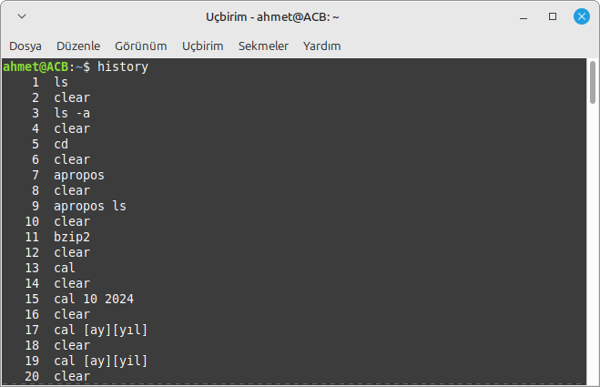

## `dmesg` Komutu
Kernel mesajlarını gösterir.
 ```Bash
dmesg
```

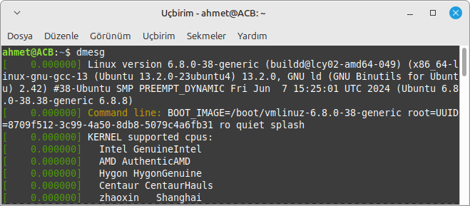

## `dmesg | grep error` Komutu
dmesg çıktısındaki hataları filtreler.
 ```Bash
dmesg | grep error
```


## `lsof` Komutu
Açık dosyaları listeler.
 ```Bash
lsof
```

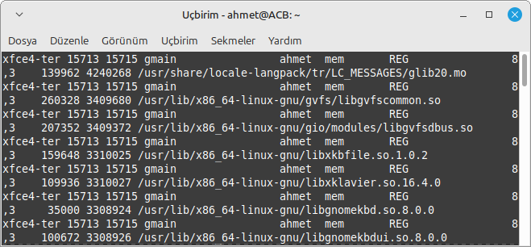

## `ps` Komutu
Çalışan süreçleri gösterir.
 ```Bash
ps
```

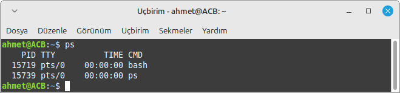

## `vmstat ` Komutu
 Sistem durumu bilgilerini gösterir.
 ```Bash
vmstat 
```


## `sysctl -a` Komutu
Tüm çekirdek parametrelerini listeler.

 ```Bash
sysctl -a
```


## `vmstat ` Komutu
 Sistem durumu bilgilerini gösterir.
 ```Bash
vmstat 
```


## `last ` Komutu
Sistem oturumlarını listeler.
 ```Bash
last 
```


## `less ` Komutu
Dosya içeriğini sayfa sayfa görüntüler.
 ```Bash
less 
```


## `sudo ` Komutu
Yönetici haklarıyla komutla çalıştırır.
 ```Bash
sudo 
```


## `sudo visudo` Komutu
sudokesintileri düzenler.
```Bash
sudo visudo
```

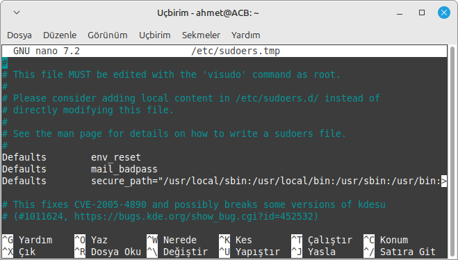

# yedekleme ve senkronizasyon


## `rsync` Komutu
Dosya saklamayı yapar.
```Bash
rsync
```

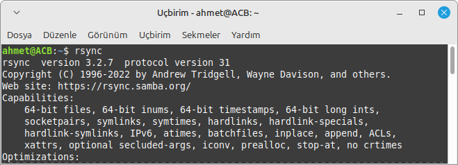


# Kullanıcı ve Hesap Yönetimi

## `adduser` Komutu
Bir kullanıcı oluşturmak için kullanılan bir yardımcı programdır.

```Bash
adduser
```

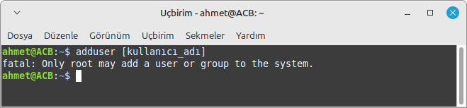

## `whomi` Komutu
Betiği hangi kullanıcının çalıştırdığını gösterir.

```Bash
whoami
```

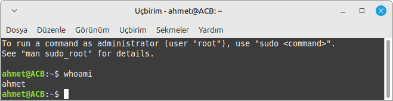

## `passwd` Komutu
Kullanıcı hesapları için parolaları değiştirir.

```Bash
passwd
```

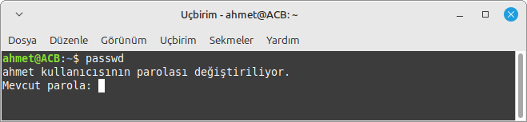

## `passwd -l` Komutu
Kullanıcı parolasını kilitler.
```Bash
passwd -l
```

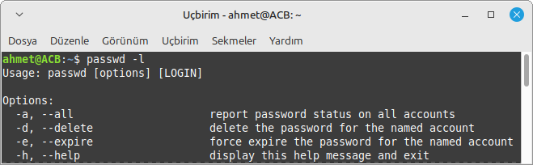


## `id` Komutu
Gerçek ya da etkin kimlik yerine oturum açma kimliğini yazdığını belirtir.

```Bash
id
```

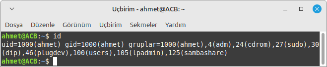

## `deluser` Komutu
Bir kullanıcıyı siler.
```Bash
deluser
```

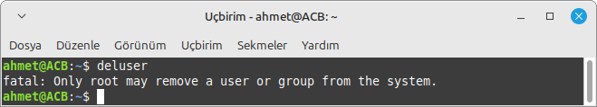

## `useradd` Komutu
 Yeni bir kullanıcı hesabı ekler.
```Bash
useradd
```


## `useradd -m` Komutu
Yeni kullanıcı için ev dizini oluşturur.
```Bash
useradd -m
```

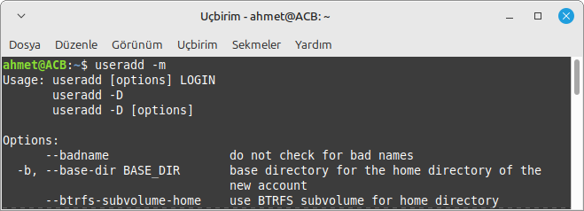

## `useradd -s` Komutu
Kullanıcı için shell belirtir.
```Bash
useradd -s
```

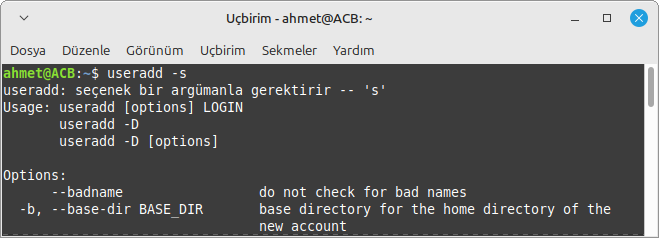

## `chage` Komutu
Kullanıcı parolasının süresini ayarlamak için kullanılır.
```Bash
chage
```

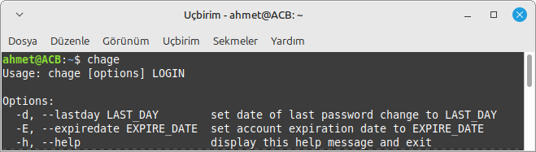

## `groupadd` Komutu
Yeni bir kullanıcı grubu oluşturur.
```Bash
groupadd
```

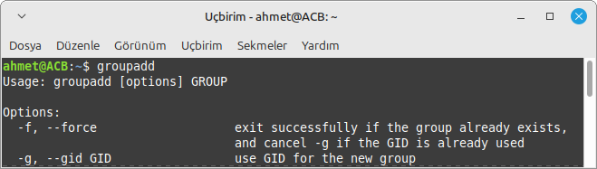

## `groupdel` Komutu
Bir kullanıcı grubunu siler.
```Bash
groupdel
```

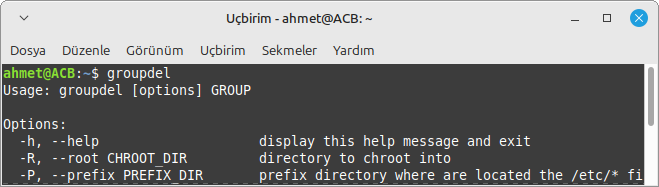

## `groups` Komutu
Kullanıcının dahil olduğu grupları gösterir.
```Bash
groups
```

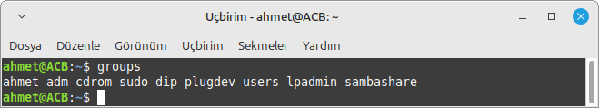


# Dosya ve Dizin Yönetimi

## `ls` Komutu
İlgili dizide(klasörde) ki diğer erişilebilir dizileri gösteriyor.

```Bash
ls
```

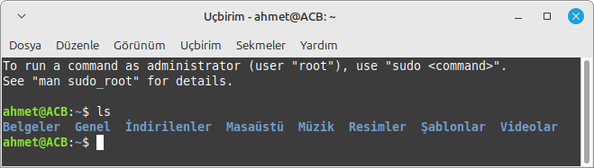

## `ls -a` Komutu
Bir dizinin içeriğini ek ayrıntılarla birlikte(gizli dosyalar dahil) bir liste olarak görüntülemek için kullanılır.

```Bash
ls -a
```

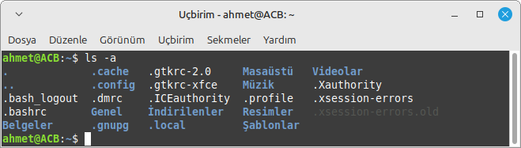

## `pwd` Komutu
Mevcut dizinin yolunu yazdıran bir komuttur.

```Bash
pwd
```

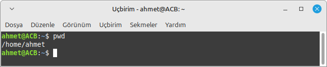

## `touch` Komutu
ir bilgisayar dosyasının veya dizininin son kullanım ve/veya düzenlenme tarihini güncellemek için kullanılan bir komuttur.

```Bash
touch
```

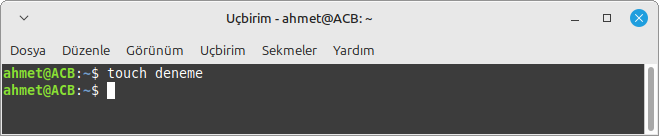

## `clear` Komutu
Yazılan komutları ekranı temizler.

```Bash
clear
```


## `ls -a` Komutu
Bir dizinin içeriğini ek ayrıntılarla birlikte(gizli dosyalar dahil) bir liste olarak görüntülemek için kullanılır.

```Bash
ls -a
```


## `cd ..` Komutu
Bir üst dizine geçer.
```Bash
cd ..
```

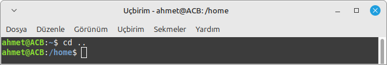

## `ln` Komutu
Dosya için bağlantı oluşturur
```Bash
ln
```

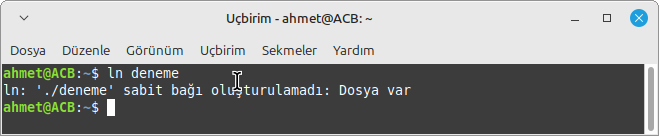

## `ln -s` Komutu
Sembolik bağlantı oluşturur.
```Bash
ln -s
```

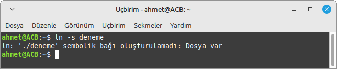

## `ls -l` Komutu
Dosya ve dizinleri uzun formatta listeler.
```Bash
ls -l
```

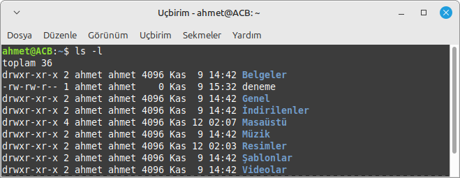

## `mkdir` Komutu
Yeni bir dizin oluşturur.
```Bash
mkdir
```

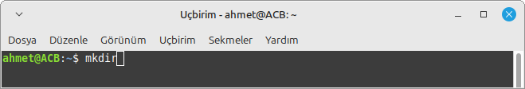

## `mv` Komutu
Dosya veya dizin taşır veya yeniden adlandırır.
```Bash
mv
```


## `rm` Komutu
Dosya veya dizin siler.
```Bash
rm
```


## `find` Komutu
Dosya aramak için kullanılır.
```Bash
find
```

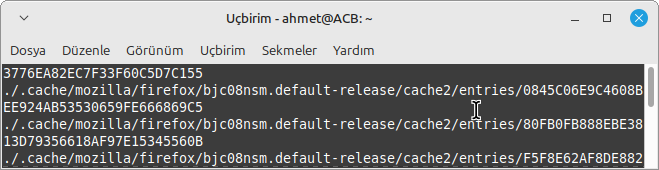

## `file` Komutu
Dosyanın türünü gösterir.
```Bash
file
```

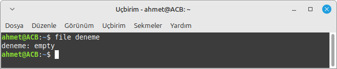

## `stat` Komutu
Dosyanın veya dizinin stat bilgilerini gösterir.
```Bash
stat
```

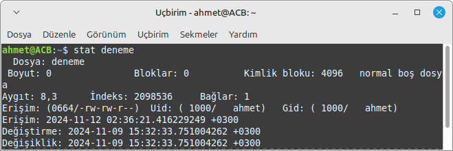

## `du` Komutu
Dizin ve dosyaların disk kullanımını gösterir.
```Bash
du
```

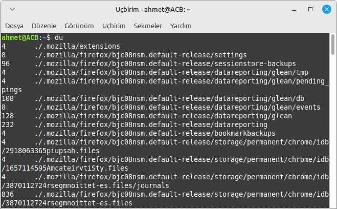

## `lsusb` Komutu
USB aygıtlarını listeler.
```Bash
lsusb
```

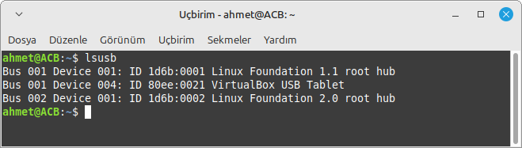

## `lsusb -v` Komutu
USB aygıtlarının ayrıntılı bilgisini gösterir.
```Bash
lsusb -v```

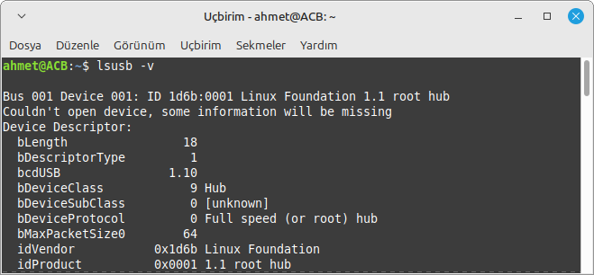

# Sistem Kapama ve Yeniden Başlatma

## `poweroff` Komutu
Sistemi kapatır.
```Bash
poweroff
```

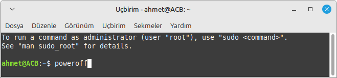

## `shut` Komutu
Bilgisayarın sağlıklı bir şekilde kapanmasını sağlar.

```Bash
shut
```

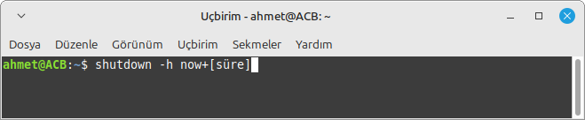

## `halt` Komutu
Sistemi hemen kapatır.
```Bash
halt
```

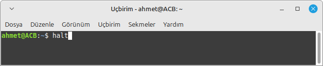

## `reboot` Komutu
Sistemi yeniden başlatır.
```Bash
reboot
```


# Ağ ve İletişim

## `echo` Komutu
Karakter dizgilerini standart çıkışa yazar.

```Bash
echo
```

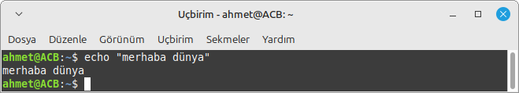

## `date` Komutu
İşaret olmadan ya da + (artı işareti) ile başlayan bir işaret listesiyle çağrılırsa, geçerli tarih ve saati standart çıkışa yazar.

```Bash
date
```


## `aprops ls` Komutu
Belirtilen dize veya dizeleri ( anahtar sözcükler olarak adlandırılır) tüm kılavuz sayfalarının "ad" bölümlerinde aramak için kullanılır.

```Bash
aprops ls
```


## `wget` Komutu
Dosya indirmek için kullanılır.
```Bash
wget
```


## `curl` Komutu
Verileri almak veya göndermek için kullanılır.
```Bash
curl
```


## `hostname` Komutu
Sistemin hostname'ini gösterir.
```Bash
hostname
```


## `route` Komutu
Yönlendirme tablosunu gösterir.
```Bash
route
```


## `dig` Komutu
DNS sorguları yapar.
```Bash
dig
```


## `nslookup` Komutu
İşaret olmadan ya da + (artı işareti) ile başlayan bir işaret listesiyle çağrılırsa, geçerli tarih ve saati standart çıkışa yazar.

```Bash
nslookup
```


## `ss -tuln` Komutu
Dinleyen soket bağlantılarını gösterir.
```Bash
ss -tuln
```


## `ss` Komutu
 Soket bağlantılarını gösterir.
```Bash
ss
```


## `netstat -tuln` Komutu
Dinleyen ağ bağlantılarını gösterir.
```Bash
netstat -tuln
```


## `netstat -rn` Komutu
Yönlendirme tablosunu gösterir
```Bash
netstat -rn
```


## `netstat -an` Komutu
Ağ bağlantılarını ve portları listeler.
```Bash
netstat -an
```


## `netstat` Komutu
Ağ bağlantılarının listesini gösterir.
```Bash
netstat
```


## `scp` Komutu
Güvenli dosya kopyalama komutu.
```Bash
scp
```


## `ssh` Komutu
Dosya indirmek için kullanılır.
```Bash
ssh
```


## `scp` Komutu
Güvenli dosya kopyalama komutu.
```Bash
scp
```


# Diğer Kullanışlı Komutlar


## `!!` Komutu
En son çalıştırılan komutu tekrar çalıştırır.

```Bash
!!
```


## `fdisk` Komutu
Sabit diskte bölümler oluşturmak, silmek, yeniden boyutlandırmak, değiştirmek ve taşımak için kullanılır.

```Bash
fdisk
```


## `alias` Komutu
Komutlara kısaltmalar tanımlar.

```Bash
alias
```


## `sed` Komutu
Akış düzenleyicisi, metin üzerinde işlemler yapar.

```Bash
sed
```


## `awk` Komutu
Metin işleme ve veri analizi aracı.

```Bash
awk
```


## `watch` Komutu
Komutları belirli aralıklarla tekrar eder.

```Bash
watch
```


## `zip` Komutu
Dosya sıkıştırma komutudur.

```Bash
zip
```


## `stat` Komutu
Dosyanın ya da dizinin durumunu gösterir.

```Bash
stat
```


