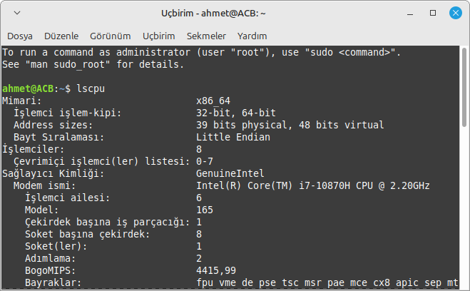

# Linux-Komutlari

## `ls` Komutu
İlgili dizide(klasörde) ki diğer erişilebilir dizileri gösteriyor.

```Bash
ls
```


## `ls -a` Komutu
Bir dizinin içeriğini ek ayrıntılarla birlikte bir liste olarak görüntülemek için kullanılır.

```Bash
ls -a
```


## `aprops ls` Komutu
Belirtilen dize veya dizeleri ( anahtar sözcükler olarak adlandırılır) tüm kılavuz sayfalarının "ad" bölümlerinde aramak için kullanılır.

```Bash
aprops ls
```


## `apropos` Komutu
Bir veya daha fazla anahtar kelime içeren satırları yazdırır.


## `df` Komutu
Bir dosya sisteminde yer alan toplam alana ve kullanılabilir alana ilişkin bilgileri görüntülemek için kullanılır.


## `top` Komutu
Çalışan işlemlerin ve çekirdek tarafından yönetilen görevlerin dinamik, gerçek zamanlı görünümünü gösterir.


## `whomi` Komutu
Betiği hangi kullanıcının çalıştırdığını gösterir.


## `poweroff` Komutu
Sistemi kapatır.


## `!!` Komutu
En son çalıştırılan komutu tekrar çalıştırır.


## `uptime` Komutu
 Sistemin ne kadar süre aktif kaldığını gösterir.


## `ifconfig` Komutu
Ağ arabirimi STRUCTURE yapısının dinamik olarak yaratılmasına ya da çekirdek belleğinden silinmesine olanak tanıyan ağ arabirimi yapılandırma aracıdır.


## `echo` Komutu
Karakter dizgilerini standart çıkışa yazar.


## `id` Komutu
Gerçek ya da etkin kimlik yerine oturum açma kimliğini yazdığını belirtir.



## `lscpu` Komutu
 Sistemdeki CPU'lar hakkında ayrıntılı bir bilgi listesi sağlar.


## `passwd` Komutu
Kullanıcı hesapları için parolaları değiştirir.


## `uname` Komutu
 Sistem hakkında bilgi verir. Geçerli makine ve üzerinde çalışdığı işletim sistemi hakkında isim, sürüm ve diğer ayrıntıları yazdırır.


## `neofetch` Komutu
Sisteminizin bilgilerini işletim sistemi logonuzun veya seçtiğiniz herhangi bir ASCII dosyasının hemen yanında görüntüleyen bir komut satırı aracıdır.


## `pwd` Komutu
Mevcut dizinin yolunu yazdıran bir komuttur.


## `touch` Komutu
Bir bilgisayar dosyasının veya dizininin son kullanım ve/veya düzenlenme tarihini güncellemek için kullanılan bir komuttur.


## `clear` Komutu
Yazılan komutları ekranı temizler.


## `date` Komutu
İşaret olmadan ya da + (artı işareti) ile başlayan bir işaret listesiyle çağrılırsa, geçerli tarih ve saati standart çıkışa yazar.


## `free` Komutu
Sisteminizdeki RAM belleğini kontrol etmenizi veya Linux işletim sisteminin bellek istatistiklerini kontrol etmenizi sağlar.


## `lshw` Komutu
Sistemin sahip olduğu donanımlarla ilgili ayrıntılı bilgi veren konsol programıdır.


## `fdisk` Komutu
Sabit diskte bölümler oluşturmak, silmek, yeniden boyutlandırmak, değiştirmek ve taşımak için kullanılır.


## `history` Komutu
Komut geçmişi listesiyle çalışır.


## `shut` Komutu
Bilgisayarın sağlıklı bir şekilde kapanmasını sağlar.


## `adduser` Komutu
Bir kullanıcı oluşturmak için kullanılan bir yardımcı programdır.
