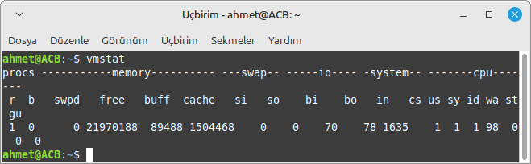
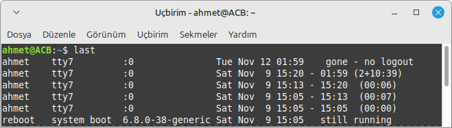

# Linux-Komutlari 👨‍💻👩‍💻


## Açıklama

Bu repo, Linux işletim sisteminde sıkça kullanılan komutları ve bu komutların kullanım örneklerini içermektedir. Her komut için açıklamalar, kullanım örnekleri ve çıktı görselleri bulunmaktadır. Bu kaynak, Linux kullanıcıları için bir referans kılavuzu olarak hazırlanmıştır ve şu kategorileri içermektedir:


## İçindekiler 🗒️
| Bölüm | Alt Başlıklar |
|-------|---------------|
| [Sistem Yönetimi ve Bilgi Görüntüleme Komutları](#sistem-yönetimi-ve-bilgi-görüntüleme-komutları-) | df, top, uptime, uname, neofetch, lscpu, ifconfig, free, lshw, history, dmesg, lsof, ps, vmstat, sysctl, systemctl, timedatectl, w |
| [Sistem Durumu ve Konfigürasyon](#sistem-durumu-ve-konfigürasyon) | init, vmstat, last, less, sudo |
| [Yedekleme ve Senkronizasyon](#yedekleme-ve-senkronizasyon) | rsync |
| [Kullanıcı ve Hesap Yönetimi](#kullanıcı-ve-hesap-yönetimi) | adduser, whoami, passwd, id, deluser, useradd, chage, groupadd, groupdel, groups |
| [Dosya ve Dizin Yönetimi](#dosya-ve-dizin-yönetimi) | ls, pwd, touch, clear, cd, ln, mkdir, mv, rm, find, file, stat, du, lsusb |
| [Sistem Kapatma ve Yeniden Başlatma](#sistem-kapatma-ve-yeniden-başlatma) | poweroff, shut, halt, reboot |
| [Ağ ve İletişim](#ağ-ve-iletişim) | echo, date, apropos, wget, curl, hostname, route, dig, nslookup, ss, netstat, ssh, scp |
| [Diğer Kullanışlı Komutlar](#diğer-kullanışlı-komutlar) | !!, fdisk, alias, sed, awk, watch, zip, stat |

# Sistem Yönetimi ve Bilgi Görüntüleme Komutları 🖥️

## `df` Komutu
Bir dosya sisteminde yer alan toplam alana ve kullanılabilir alana ilişkin bilgileri görüntülemek için kullanılır.

```Bash
df
```


## `df -a` Komutu
Dosya sisteminin tüm ayrıntılarını gösterir.

 ```Bash
df -a
```


## `df -h` Komutu
Dosya sisteminin kullanım bilgilerini insan tarafından okunabilir formatta gösterir.
 ```Bash
df -h
```


## `df -i` Komutu
Dosya sistemi inode kullanım bilgilerini gösterir.
 ```Bash
df -i
```


## `top` Komutu
Çalışan işlemlerin ve çekirdek tarafından yönetilen görevlerin dinamik, gerçek zamanlı görünümünü gösterir.

```Bash
top
```


## `top -d 5` Komutu
omutunu her 5 saniyede bir günceller.
```Bash
top -d 5
```


## `top -n 10` Komutu
komutunun çıktısını 10 kez tekrarlar.
```Bash
top -n 10
```


## `top -p 1234` Komutu
Belirtilen işlem ID'sine (PID) sahip işlemi top komutuyla gösterir.
```Bash
top -p 1234
```


## `top -u username` Komutu
Belirli bir kullanıcının işlemlerini gösterir.
```Bash
top -u username
```


## `uptime` Komutu
 Sistemin ne kadar süre aktif kaldığını gösterir.

 ```Bash
uptime
```


## `uname` Komutu
 Sistem hakkında bilgi verir. Geçerli makine ve üzerinde çalışdığı işletim sistemi hakkında isim, sürüm ve diğer ayrıntıları yazdırır.

```Bash
uname
```


## `neofetch` Komutu
Sisteminizin bilgilerini işletim sistemi logonuzun veya seçtiğiniz herhangi bir ASCII dosyasının hemen yanında görüntüleyen bir komut satırı aracıdır.

```Bash
neofetch
```


## `lscpu` Komutu
 Sistemdeki CPU'lar hakkında ayrıntılı bir bilgi listesi sağlar.

```Bash
lscpu
```


## `ifconfig` Komutu
Ağ arabirimi STRUCTURE yapısının dinamik olarak yaratılmasına ya da çekirdek belleğinden silinmesine olanak tanıyan ağ arabirimi yapılandırma aracıdır.

```Bash
ifconfig
```


## `free` Komutu
Sisteminizdeki RAM belleğini kontrol etmenizi veya Linux işletim sisteminin bellek istatistiklerini kontrol etmenizi sağlar.

```Bash
free
```


## `lshw` Komutu
Sistemin sahip olduğu donanımlarla ilgili ayrıntılı bilgi veren konsol programıdır.

```Bash
lshw
```


## `history` Komutu
Komut geçmişi listesiyle çalışır.

```Bash
history
```


## `dmesg` Komutu
Kernel mesajlarını gösterir.
 ```Bash
dmesg
```


## `dmesg | grep error` Komutu
dmesg çıktısındaki hataları filtreler.
 ```Bash
dmesg | grep error
```


## `lsof` Komutu
Açık dosyaları listeler.
 ```Bash
lsof
```


## `ps` Komutu
Çalışan süreçleri gösterir.
 ```Bash
ps
```


## `vmstat ` Komutu
 Sistem durumu bilgilerini gösterir.
 ```Bash
vmstat 
```



## `sysctl -a` Komutu
Tüm çekirdek parametrelerini listeler.

 ```Bash
sysctl -a
```


## `systemctl` Komutu
Systemd hizmetlerini yönetir.
 ```Bash
systemctl
```


## `timedatectl` Komutu
Tarih ve saat yönetimi.
 ```Bash
timedatectl
```


## `w` Komutu
 Sisteme giriş yapan kullanıcıları gösterir.
 ```Bash
w
```


# Sistem Durumu ve Konfigürasyon 👨‍💻


## `init ` Komutu
Sistemi farklı çalışma seviyelerine geçirir.
 ```Bash
init 
```


## `vmstat ` Komutu
 Sistem durumu bilgilerini gösterir.
 ```Bash
vmstat 
```


## `last ` Komutu
Sistem oturumlarını listeler.
 ```Bash
last 
```



## `less ` Komutu
Dosya içeriğini sayfa sayfa görüntüler.
 ```Bash
less 
```


## `sudo ` Komutu
Yönetici haklarıyla komutla çalıştırır.
 ```Bash
sudo 
```


## `sudo visudo` Komutu
sudokesintileri düzenler.
```Bash
sudo visudo
```


# yedekleme ve senkronizasyon 🕖


## `rsync` Komutu
Dosya saklamayı yapar.
```Bash
rsync
```


# Kullanıcı ve Hesap Yönetimi 👤

## `adduser` Komutu
Bir kullanıcı oluşturmak için kullanılan bir yardımcı programdır.

```Bash
adduser
```


## `whomi` Komutu
Betiği hangi kullanıcının çalıştırdığını gösterir.

```Bash
whoami
```


## `passwd` Komutu
Kullanıcı hesapları için parolaları değiştirir.

```Bash
passwd
```


## `passwd -l` Komutu
Kullanıcı parolasını kilitler.
```Bash
passwd -l
```


## `id` Komutu
Gerçek ya da etkin kimlik yerine oturum açma kimliğini yazdığını belirtir.

```Bash
id
```


## `deluser` Komutu 
Bir kullanıcıyı siler.
```Bash
deluser
```


## `useradd` Komutu
 Yeni bir kullanıcı hesabı ekler.
```Bash
useradd
```


## `useradd -m` Komutu
Yeni kullanıcı için ev dizini oluşturur.
```Bash
useradd -m
```


## `useradd -s` Komutu
Kullanıcı için shell belirtir.
```Bash
useradd -s
```


## `chage` Komutu
Kullanıcı parolasının süresini ayarlamak için kullanılır.
```Bash
chage
```


## `groupadd` Komutu
Yeni bir kullanıcı grubu oluşturur.
```Bash
groupadd
```


## `groupdel` Komutu
Bir kullanıcı grubunu siler.
```Bash
groupdel
```


## `groups` Komutu
Kullanıcının dahil olduğu grupları gösterir.
```Bash
groups
```


# Dosya ve Dizin Yönetimi 🗂️

## `ls` Komutu
İlgili dizide(klasörde) ki diğer erişilebilir dizileri gösteriyor.

```Bash
ls
```


## `ls -a` Komutu
Bir dizinin içeriğini ek ayrıntılarla birlikte(gizli dosyalar dahil) bir liste olarak görüntülemek için kullanılır.

```Bash
ls -a
```


## `pwd` Komutu
Mevcut dizinin yolunu yazdıran bir komuttur.

```Bash
pwd
```


## `touch` Komutu
ir bilgisayar dosyasının veya dizininin son kullanım ve/veya düzenlenme tarihini güncellemek için kullanılan bir komuttur.

```Bash
touch
```


## `clear` Komutu
Yazılan komutları ekranı temizler.

```Bash
clear
```


## `ls -a` Komutu
Bir dizinin içeriğini ek ayrıntılarla birlikte(gizli dosyalar dahil) bir liste olarak görüntülemek için kullanılır.

```Bash
ls -a
```


## `cd ..` Komutu
Bir üst dizine geçer.
```Bash
cd ..
```


## `ln` Komutu
Dosya için bağlantı oluşturur
```Bash
ln
```


## `ln -s` Komutu
Sembolik bağlantı oluşturur.
```Bash
ln -s
```


## `ls -l` Komutu
Dosya ve dizinleri uzun formatta listeler.
```Bash
ls -l
```


## `mkdir` Komutu
Yeni bir dizin oluşturur.
```Bash
mkdir
```


## `mv` Komutu
Dosya veya dizin taşır veya yeniden adlandırır.
```Bash
mv
```


## `rm` Komutu
Dosya veya dizin siler.
```Bash
rm
```


## `find` Komutu
Dosya aramak için kullanılır.
```Bash
find
```


## `file` Komutu
Dosyanın türünü gösterir.
```Bash
file
```


## `stat` Komutu
Dosyanın veya dizinin stat bilgilerini gösterir.
```Bash
stat
```


## `du` Komutu
Dizin ve dosyaların disk kullanımını gösterir.
```Bash
du
```


## `lsusb` Komutu
USB aygıtlarını listeler.
```Bash
lsusb
```


## `lsusb -v` Komutu
USB aygıtlarının ayrıntılı bilgisini gösterir.
```Bash
lsusb -v
```


Sistemi kapatır.

```Bash
poweroff
```


## `shut` Komutu
Bilgisayarın sağlıklı bir şekilde kapanmasını sağlar.

```Bash
shut
```


## `halt` Komutu
Sistemi hemen kapatır.
```Bash
halt
```


## `reboot` Komutu
Sistemi yeniden başlatır.
```Bash
reboot
```


# Ağ ve İletişim 🛜

## `echo` Komutu
Karakter dizgilerini standart çıkışa yazar.

```Bash
echo
```


## `date` Komutu
İşaret olmadan ya da + (artı işareti) ile başlayan bir işaret listesiyle çağrılırsa, geçerli tarih ve saati standart çıkışa yazar.

```Bash
date
```


## `aprops ls` Komutu
Belirtilen dize veya dizeleri ( anahtar sözcükler olarak adlandırılır) tüm kılavuz sayfalarının "ad" bölümlerinde aramak için kullanılır.

```Bash
aprops ls
```


## `wget` Komutu
Dosya indirmek için kullanılır.
```Bash
wget
```


## `curl` Komutu
Verileri almak veya göndermek için kullanılır.
```Bash
curl
```


## `hostname` Komutu
Sistemin hostname'ini gösterir.
```Bash
hostname
```


## `route` Komutu
Yönlendirme tablosunu gösterir.
```Bash
route
```


## `dig` Komutu
DNS sorguları yapar.
```Bash
dig
```


## `nslookup` Komutu
İşaret olmadan ya da + (artı işareti) ile başlayan bir işaret listesiyle çağrılırsa, geçerli tarih ve saati standart çıkışa yazar.

```Bash
nslookup
```


## `ss -tuln` Komutu
Dinleyen soket bağlantılarını gösterir.
```Bash
ss -tuln
```


## `ss` Komutu
 Soket bağlantılarını gösterir.
```Bash
ss
```


## `netstat -tuln` Komutu
Dinleyen ağ bağlantılarını gösterir.
```Bash
netstat -tuln
```


## `netstat -rn` Komutu
Yönlendirme tablosunu gösterir
```Bash
netstat -rn
```


## `netstat -an` Komutu
Ağ bağlantılarını ve portları listeler.
```Bash
netstat -an
```


## `netstat` Komutu
Ağ bağlantılarının listesini gösterir.
```Bash
netstat
```


## `ssh` Komutu
Dosya indirmek için kullanılır.
```Bash
ssh
```


## `scp` Komutu
Güvenli dosya kopyalama komutu.
```Bash
scp
```


# Diğer Kullanışlı Komutlar ♟️


## `!!` Komutu
En son çalıştırılan komutu tekrar çalıştırır.

```Bash
!!
```


## `fdisk` Komutu
Sabit diskte bölümler oluşturmak, silmek, yeniden boyutlandırmak, değiştirmek ve taşımak için kullanılır.

```Bash
fdisk
```


## `alias` Komutu
Komutlara kısaltmalar tanımlar.

```Bash
alias
```


## `sed` Komutu
Akış düzenleyicisi, metin üzerinde işlemler yapar.

```Bash
sed
```


## `awk` Komutu
Metin işleme ve veri analizi aracı.

```Bash
awk
```


## `watch` Komutu
Komutları belirli aralıklarla tekrar eder.

```Bash
watch
```


## `zip` Komutu
Dosya sıkıştırma komutudur.

```Bash
zip
```


## `stat` Komutu
Dosyanın ya da dizinin durumunu gösterir.

```Bash
stat
```


## Kaynakça 📨

1. Linux man pages. (t.y.). die.net. https://linux.die.net/man/


## Uyarı ‼️
Bazı komutlar sisteminiz üzerinde değişiklikler yaparak veri kaybına neden olabilir.Lütfen komutları kullanırken ne işe yaradıklarına dikkat edin !!

## İletişim 📞
ahmetcanbozkurt295@gmail.com


